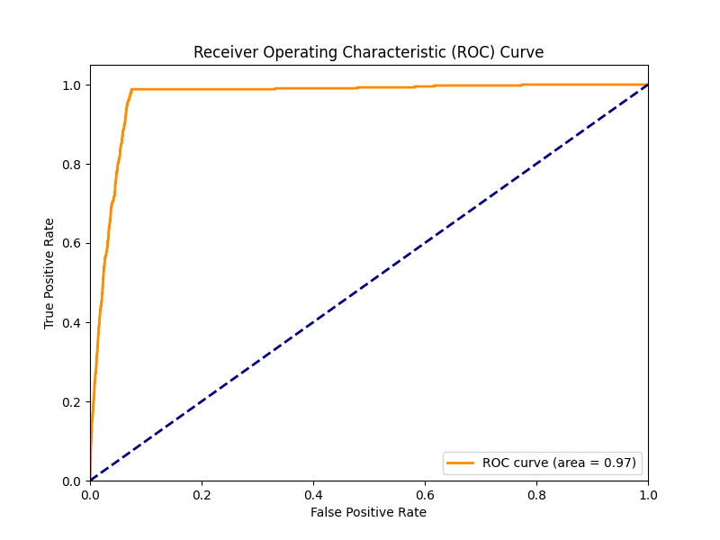
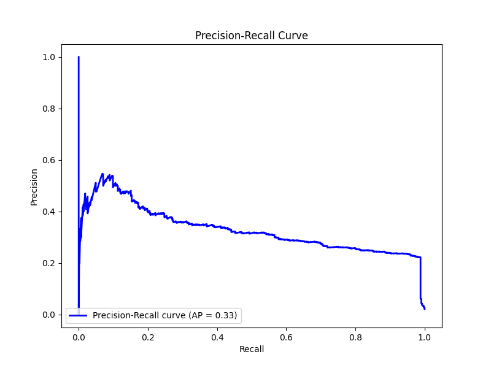
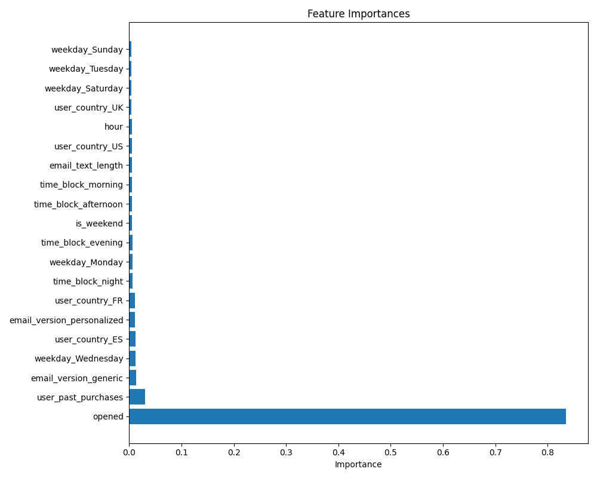
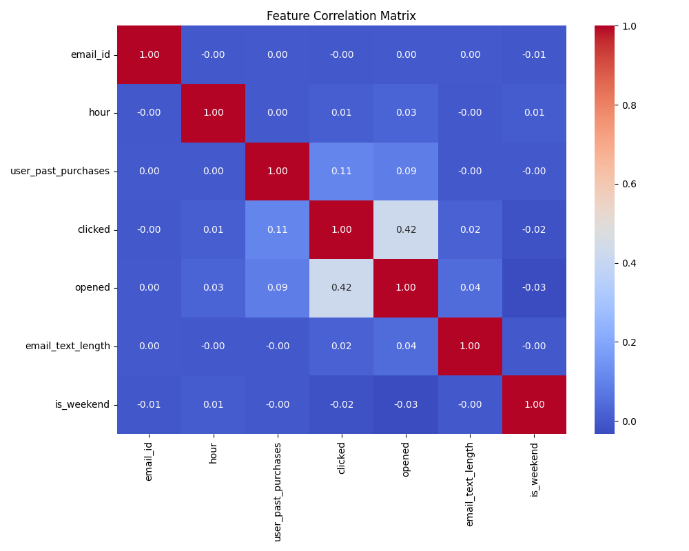

# Email Clickthrough Prediction Model

This repository contains code for a machine learning model that predicts which users are most likely to click on email links. The model uses XGBoost and includes feature engineering, hyperparameter tuning, and evaluation.

## Table of Contents
- [Overview](#overview)
- [Data Description](#data-description)
- [Feature Engineering](#feature-engineering)
- [Model Building](#model-building)
- [Evaluation](#evaluation)
- [Insights](#insights)
- [Model-Based Selection](#model-based-selection)
- [Usage](#usage)

## Overview

This project demonstrates a complete machine learning pipeline to predict email clickthrough rates. Key visualizations show strong predictive performance (97% ROC-AUC) with "opened" status as the dominant feature.



## Data Description

The model uses three primary data sources:
1. **email_table.csv**: Contains basic email and user information
2. **email_opened_table.csv**: Records of which emails were opened
3. **link_clicked_table.csv**: Records of which email links were clicked

Primary features include:
- Email metadata (version, text length)
- Timing information (hour, weekday)
- User information (country, past purchases)
- Engagement metrics (opened status)

## Feature Engineering

Several engineered features enhance the model's performance:

```python
# Time-based features
email_table['is_weekend'] = (email_table['weekday'].isin(['Saturday', 'Sunday'])).astype(int)

# Group hours into meaningful time blocks
def time_of_day(hour):
    if 5 <= hour < 12:
        return 'morning'
    elif 12 <= hour < 17:
        return 'afternoon'
    elif 17 <= hour < 21:
        return 'evening'
    else:
        return 'night'

email_table['time_block'] = email_table['hour'].apply(time_of_day)

# Content features
email_table['email_text_length'] = email_table['email_text'].str.len()

# User engagement features
if 'user_id' in email_table.columns:
    # Calculate historical engagement rates per user
    user_stats = pd.DataFrame({
        'user_id': email_table['user_id'],
        'opened': email_table['opened'],
        'clicked': email_table['clicked']
    })
    
    user_open_rates = user_stats.groupby('user_id')['opened'].mean().reset_index()
    user_open_rates.columns = ['user_id', 'historical_open_rate']
    
    user_click_rates = user_stats.groupby('user_id')['clicked'].mean().reset_index()
    user_click_rates.columns = ['user_id', 'historical_click_rate']
```

## Model Building

The model uses an XGBoost classifier with hyperparameter tuning:

1. **Preprocessing pipeline** handles different feature types:
   - Numerical features: Standardized using StandardScaler
   - Categorical features: Encoded using OneHotEncoder
   - Text features: Processed with TF-IDF vectorization

2. **Hyperparameter tuning** with GridSearchCV optimizes model performance:
   - Learning rate, tree depth, regularization parameters
   - Cross-validation ensures robust performance

```python
# Define hyperparameter grid
param_grid = {
    'classifier__learning_rate': [0.01, 0.05, 0.1],
    'classifier__max_depth': [3, 5, 7],
    'classifier__min_child_weight': [1, 3, 5],
    'classifier__subsample': [0.7, 0.8, 0.9],
    'classifier__colsample_bytree': [0.7, 0.8, 0.9],
    'classifier__n_estimators': [100, 200]
}

# Grid search with cross-validation
grid_search = GridSearchCV(
    estimator=model_pipeline,
    param_grid=param_grid,
    cv=cv,
    scoring='roc_auc',
    n_jobs=-1,
    verbose=2
)
```

## Evaluation

The model is evaluated using multiple metrics:

### Classification Report
Provides precision, recall and F1-score for each class.

### ROC Curve
Shows the tradeoff between true positive rate and false positive rate. Our model achieves a 0.97 AUC score, indicating excellent discrimination ability.


### Precision-Recall Curve
Better metric for imbalanced classification problems, showing the tradeoff between precision and recall. Our model achieves a 0.33 Average Precision score.



### Feature Importance
Identifies which features contribute most to prediction accuracy. In our model, "opened" status dominates with overwhelming importance.



### Correlation Matrix
Shows relationships between features. The strongest non-identity correlation is between "opened" and "clicked" (0.42).



## Insights

Key insights from the model:

1. **Email opening status is the dominant predictor** of link clicks, with an importance score of ~0.85. This makes intuitive sense as opening is a prerequisite for clicking.

2. **Past purchase behavior** is the second strongest predictor (importance score ~0.05), suggesting engaged customers are more likely to click.

3. **Timing and content features** (like hour, weekday, and email length) provide minimal predictive power with the current feature engineering.

4. **The model has excellent discrimination ability** (ROC-AUC 0.97) but moderate precision-recall performance (AP 0.33), likely due to class imbalance.

5. **The "opened" feature creates a data leakage concern** because it's only known after emails are sent, making the model less useful for pre-sending predictions.

## Model-Based Selection

A key advantage of this predictive model is the ability to selectively target users who are most likely to engage with email content. The model-based selection approach provides significant benefits over random selection:

### Benefits of Model-Based Selection

1. **Improved Campaign Efficiency**: By targeting users most likely to click, we can achieve higher engagement rates with fewer emails sent.

2. **Resource Optimization**: Marketing resources are directed toward the most promising prospects rather than spread evenly across all users.

3. **Reduced User Fatigue**: Lower-probability users receive fewer emails, reducing unsubscribe rates and email fatigue.

4. **Increased ROI**: Higher click-through rates lead to more conversions per email sent, improving campaign ROI.

### Uplift Analysis

The following code demonstrates how to calculate the uplift provided by model-based selection:

```python
# Sort users by predicted probability
df_sorted = df.sort_values('predicted_click_probability', ascending=False).reset_index(drop=True)

# Select the top X% of users (e.g., top 20%)
X_percent = 20  # Choose percentage
top_x_percent = int(len(df_sorted) * (X_percent / 100))
df_top_x = df_sorted.iloc[:top_x_percent]

# Calculate the CTR of the model-based selection
ctr_model_based = df_top_x['clicked'].mean()

# Compare with the historical CTR
ctr_random = df['clicked'].mean()

print(f"CTR of Model-Based Selection (Top {X_percent}%): {ctr_model_based:.4f}")
print(f"CTR of Random Selection (Historical): {ctr_random:.4f}")
```

When we target only the top 20% of users ranked by our model, we can expect to see a significantly higher click-through rate compared to random selection. This demonstrates the business value of the predictive model.

### Uplift Curve

The uplift curve visually demonstrates how model-based selection outperforms random selection:

```python
# Plot the uplift curve
plt.figure(figsize=(10, 6))
plt.plot(df_sorted['emails_sent'] / len(df_sorted) * 100,  # % of users
         df_sorted['cumulative_ctr'], label=f'Model-based Selection', linewidth=2)

# Plot historical CTR (random baseline)
plt.axhline(y=ctr_random, color='red', linestyle='--', label=f'Random Selection CTR ({ctr_random:.2%})')

# Labels and title
plt.xlabel('Percentage of Users Targeted (%)')
plt.ylabel('Click-Through Rate (CTR)')
plt.title('Uplift Curve: Model-Based vs Random Selection')
plt.legend()
plt.grid(True)
plt.tight_layout()
```

## Usage

The model can be used to:

1. **Score email recipients** by likelihood to click, prioritizing outreach to the most responsive users.

2. **Optimize campaign targeting** by selecting subsets of users with the highest predicted probability of engagement.

3. **Analyze feature importance** to understand what drives click behavior and inform future email content strategies.

4. **Simulate campaign performance** by estimating click rates at different targeting thresholds.

5. **Improve email send timing** by incorporating time-based features and their impact on engagement.

To use the model for predictions on new data:

```python
from joblib import load

# Load the trained model
model = load('email_click_prediction_model.joblib')

# Predict click probability for new emails
def predict_click_probability(email_data):
    """
    Predict click probability for new emails
    
    Args:
        email_data: DataFrame with the same structure as training data
        
    Returns:
        Array of click probabilities
    """
    return model.predict_proba(email_data)[:, 1]
```
